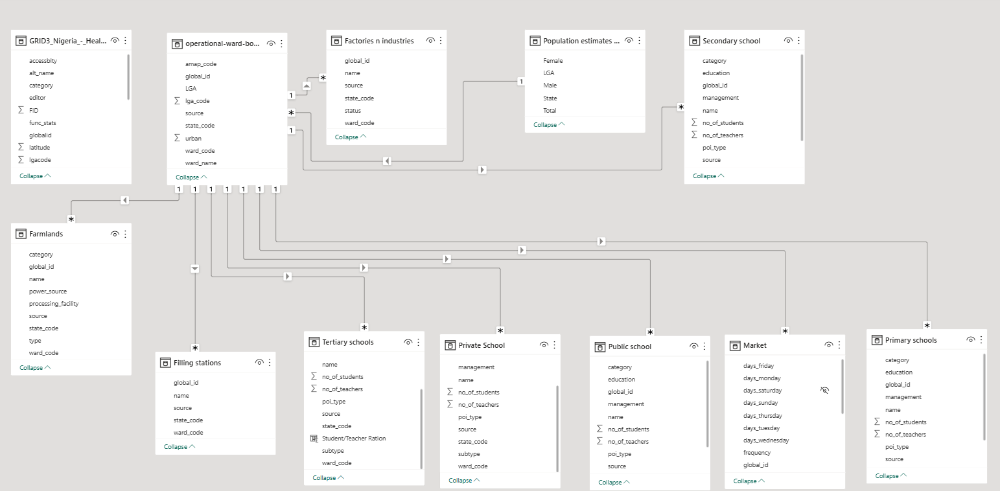
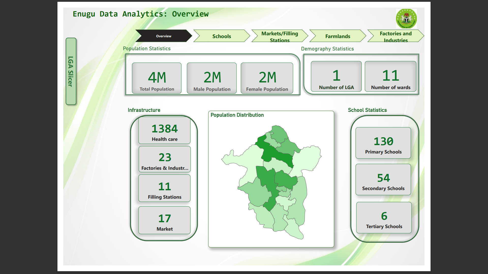
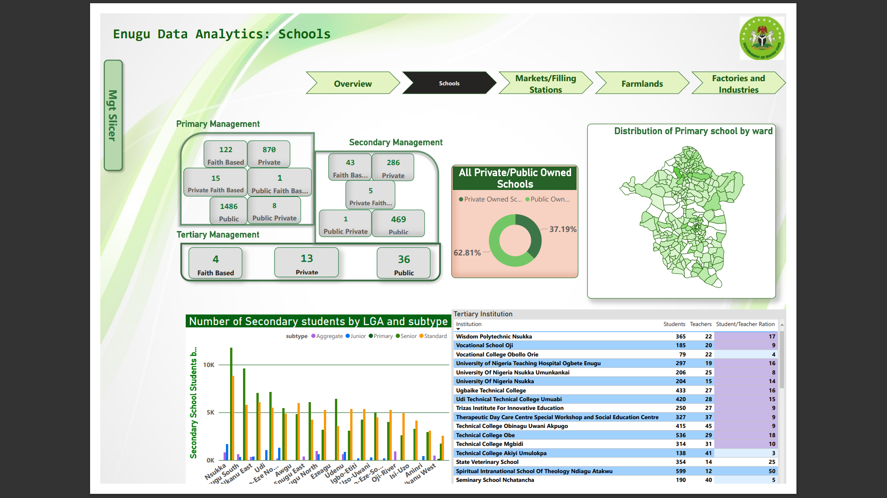
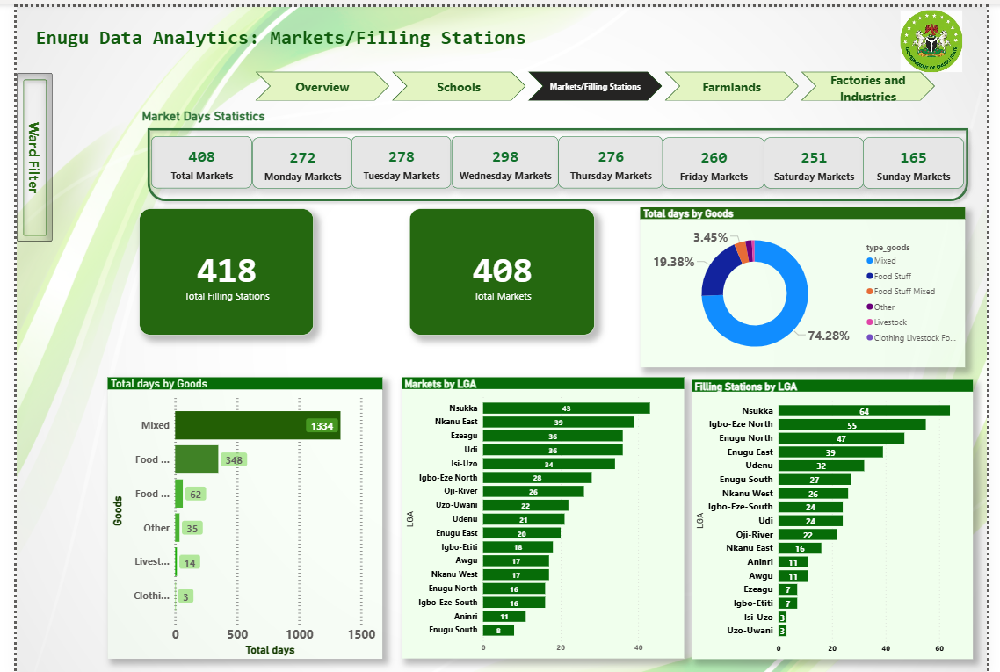

# Enugu-Data-Analytics

## Introduction

This power bi projects portrays insight about the population  of **Enugu states** along side various institutions ranging from schools to factories to different markets and other business establishment.This is to help the state government make some financial decision and make some policies on how to govern the state. 

**_Disclaimer_**: _The data set in this report does not represent the actual data in Enugu State. This is acutally a fictional data set._

## Problem Statement
- What is the total population in the state?
- What is the total count of infrastructure like health care facilities, Markets, Filling Staions, Factories and industries?
- What is the total count of schools in their various category.
- How many number of schools do we have under this categories
    - Public
    - Private
    - Faith Based
    - Private Faith Based
    - Public Faith Based
    - Private/Public
  - What is the percentage of Private owned schools as to the public owned ones?
  - What is the distributin of schools in ward
  - What is the total Number of markets and Filling Stations per Local Government Area?
  - Total number of Farms per Ward.
  - What is the total count of farms per category?
  - What is the total number of Factories and Total factories per ward.
  - Which factories are still in use and does out if use?

  

## Skill Demostrated
The Follwing Power BI feautures were incoporated
1. Visualization
2. Modelling
3. Bookmarking
4. Page Navigation
5. Hidden Filters
6. Tool Tips

## Data Sourcing
The Data was sources from the Web.

## Data Trasformation
The Data was clean and there was not much transformation done. There was no generated columns and all values were in tact.

## Modelling
There Analysis was done with 12 dataset are there was need for modelling. All automatically generated models were readjusted and correctly modeled as shown below.
The Model was a star schema model and there was multiple one to many relationship with one many to one relationship.

## Analysis and Visualization
The analysis was a 5 paged report.
- Overview
- Schools
- Market and Filling Staions
- Farmland
- Factories and Industries

  |Overview              |Schools              |Market / Filling Station | Farmland          | Factories/Industries
  |----------------------|---------------------|-------------------------|-------------------|----------------------
  |     |     |
  

## Conclusion and Recommendation
